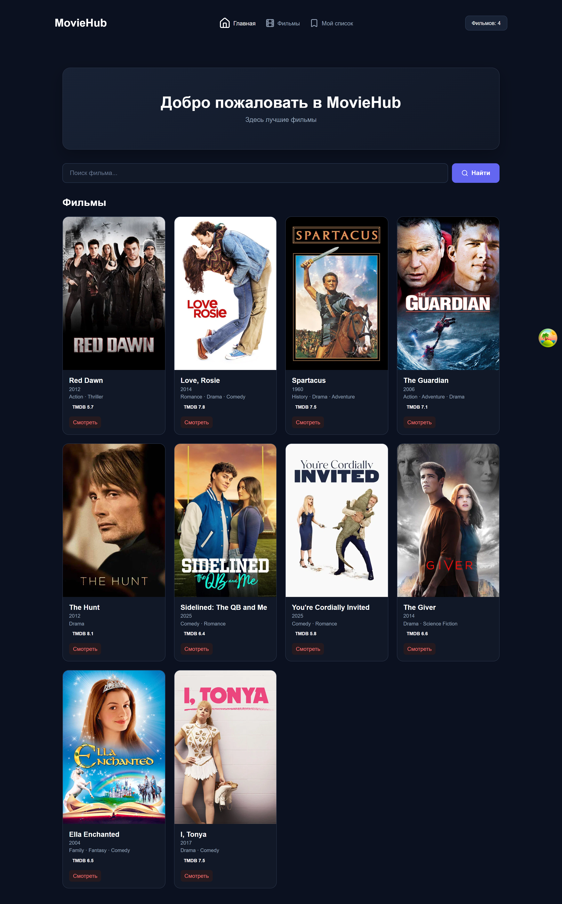

🎬 MovieHub

MovieHub — веб-приложение для поиска фильмов, просмотра информации о них и формирования списка «Посмотреть позже».

Проект разработан на React + TypeScript в учебных целях для практики работы с современным React-стеком.

✨ Возможности
🎬 просмотр списка фильмов
🔎 поиск фильмов
⭐ отображение рейтингов
🎭 отображение жанров
📋 добавление фильмов в список «Посмотреть позже»
🗑️ удаление фильмов из списка
📝 добавление фильма через форму
✅ валидация формы
🔄 обработка загрузки и ошибок API
🧭 навигация между страницами
📱 адаптивная верстка для ПК, планшетов и телефонов
✨ анимации интерфейса
🛠️ Технологии
React
TypeScript
Vite
React Router
Axios
TanStack Query
React Hook Form
Zod
CSS Modules
Lucide React
Motion
🌐 API

Для получения информации о фильмах используется TMDB API.

📸 Скриншоты
💻 Desktop
Главная

Фильмы

Мой список

📱 Tablet
Главная

Фильмы

Мой список

📱 Mobile
Главная

Фильмы

Мой список

🚀 Запуск проекта

Клонировать репозиторий:

git clone https://github.com/NikPonzep/MovieHubTs.git

Перейти в папку проекта:

cd MovieHubTs

Установить зависимости:

npm install

Запустить проект:

npm run dev
📁 Структура проекта
src/
├── components/
│   ├── AddMovieForm/
│   ├── Button/
│   ├── Header/
│   ├── MovieCard/
│   ├── MovieList/
│   └── WatchList/
│
├── pages/
│   ├── Home/
│   ├── Movies/
│   └── WatchListPage/
│
├── domain/
├── services/
├── mocks/
├── App.tsx
├── main.tsx
└── index.css
🎯 Цель проекта

Проект создан для практического изучения React и TypeScript, работы с API, состоянием приложения, формами, валидацией, маршрутизацией и адаптивной версткой.

🔗 Репозиторий

GitHub — MovieHubTs
